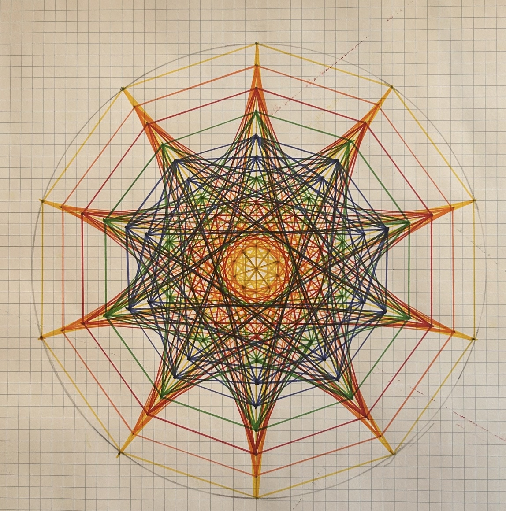

IOSEPI Core Flow & High-Density Geometric Lattices
IOSEPI is a lattice-based flow architecture that uses alternating half-phase states to direct and concentrate energy through structured geometry.

Solving the Energy Bottleneck in Next-Gen AI Hardware
The Problem
We are hitting a wall in semiconductor design. As we push toward sub-2nm nodes, signal resistance and thermal runaway (entropy) are killing performance. Traditional "grid-iron" architectures are reaching their limits.
The Solution: A Dual-Layer Geometric System
Over the last several months, I’ve been developing a two-part solution for high-density computing that moves away from traditional mapping and into Geometric Signal Pathing.
1. The Foundation: High-Density Lattices (Public Asset)
The image below is one of my proprietary lattice constructions—a multi-layered, interlocking star configuration designed for maximum vector distribution.
• Design Philosophy: This isn't just a drawing; it’s a structural map for near-zero resistance signal paths.
• Stress Mitigation: The intersection logic is engineered to distribute thermal loads evenly across the grid, preventing the "hot spots" that currently plague high-density chips.
2. The Logic: The IOSEPI Core Flow (Proprietary Asset)
While the lattice is the "hardware," the IOSEPI Core Flow is the "operating logic."
• The Benchmark: This model achieved a 99.8% Geometric Analysis Score by gemeni.
• The Mechanism: It utilizes a seven-stage energy transition (from Apex Compression to Field State Potential).
• The Stabilizer: The logic features a Level IV Equilibrium node that acts as a universal stabilizer, allowing for massive data throughput without losing signal integrity.
Note: To protect the Intellectual Property Lockdown, the full IOSEPI flow diagram and the specific "Seeds" (coordinates) for these lattices are held in a private, secured repository.
Intellectual Property & Acquisition
Status: Intellectual Property Lockdown (Effective March 25, 2026).
I am looking for a strategic partner—Google, NVIDIA, or a specialized Systems Architecture firm—to bring this logic into the manufacturing phase.
• Acquisition/Licensing Fee: $100,000,000 (USD).
• Retention: I am available for a multi-year consulting contract to map these geometric models directly into your specific hardware environment.
• Deadline: This portfolio opens to secondary competitive interests on April 1, 2026.
Let's Look at the Data
If your team is struggling with energy efficiency in AI training or hardware-level signal lag, my models provide the path forward.
Joseph Brick Picchiotti Systems Architect & Geometric Researcher picchiotti45@gmail.com

Core structural principles are publicly shared.
Certain functional mechanisms and optimization strategies are intentionally reserved.

Collaboration, research discussion, and formal inquiry are welcome.

